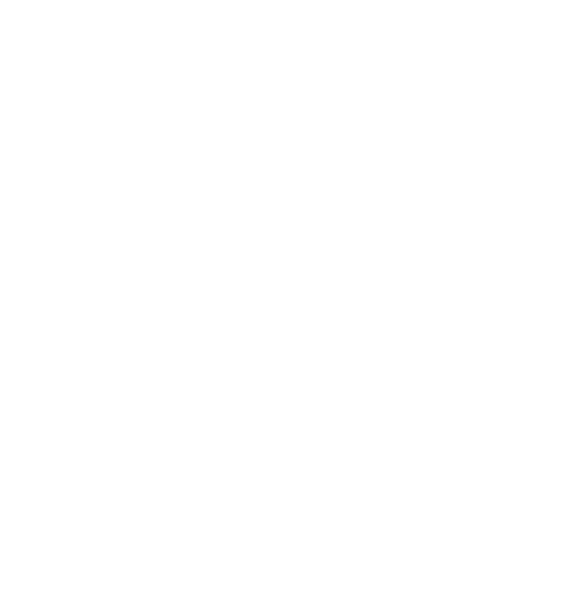

# AYZE

Short-term financing assured on the XRP Ledger.
XLS-65 (Single Asset Vault) + XLS-66 (Lending Protocol) + XLS-85 (TokenEscrow).

**Track 1 — open-ended vault — flavour Loaded.**

## The idea

A lender financing a business never loses more than **10% of their claim**, because two actors absorb 90% before them.




The broker deposits 90% of the debt as first-loss. On default, the ledger automatically pays that 90% to the vault. The insurer then reimburses 30% to the broker via the escrow ladder, bringing their net loss down to 60%. It's a CDS, with the broker as protection buyer.

## Running it

Monorepo with two npm workspaces: `ayze_src` (protocol scripts, XRPL) and `frontend` (Next.js dashboard).

```bash
npm install                 # installs both workspaces
npm run setup               # accounts → token → vault → deposit → broker → cover → loan → insurance → escrow
npm run dev                 # dashboard on http://localhost:3000
```

`npm run setup` writes `accounts.json`, `vault.json`, `broker.json`, `loan.json` and `escrow.json` into `ayze_src/`.
The dashboard reads those files and the validated ledger on every render; the demo wallets are custodial
(seeds stay server-side), and logging in as a role acts with that role's wallet.

**Network.** `wss://lending-hackathon.dev.ripplex.io:51233` by default. Override with `XRPL_WSS`
(scripts) and `frontend/.env.local` (see `frontend/.env.example`).

**Stablecoin.** RLUSD only exists on Testnet, not on Devnet, so the scripts issue a test `USD` IOU.

| # | Requirement | Script | Dashboard |
|---|---|---|---|
| 01 | Open-ended vault | `npm run vault -w ayze_src` | Lender · vault stats |
| 02 | Lender deposit | `npm run deposit -w ayze_src` | Lender · Deposit |
| 03 | Broker loan + accepted loan | `npm run broker`, `npm run cover`, `npm run loan` (`-w ayze_src`) | Broker · Add first-loss cover |
| 04 | Drawdown + one repayment | `npm run repay -w ayze_src -- regular` | Borrower · Pay instalment |
| 05 | Capital + yield withdrawal | `npm run withdraw -w ayze_src` | Lender · Withdraw |
| 06 | Transaction refused by a guardrail | `npm run guardrail -w ayze_src` | Broker · Declare default before the grace period → `tecTOO_SOON` |
| — | Default + insurance claim | `npm run default -w ayze_src` | Broker · Declare default, then Claim on the escrow |

## Structure

```
ayze_src/          XRPL scripts, one per protocol step; state in *.json (git-ignored)
frontend/
  src/server/      server-only: xrpl client, state files, ledger reads, Server Actions
  src/app/dashboard/_views/   one view per role (lender, borrower, broker, protection seller)
  src/components/  ui/ (design system) and dashboard/ (stats, tx forms)
```
