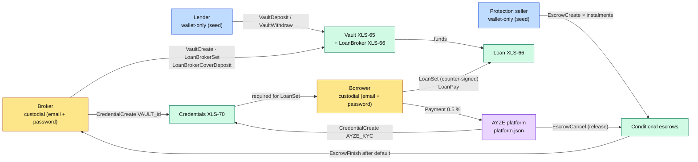
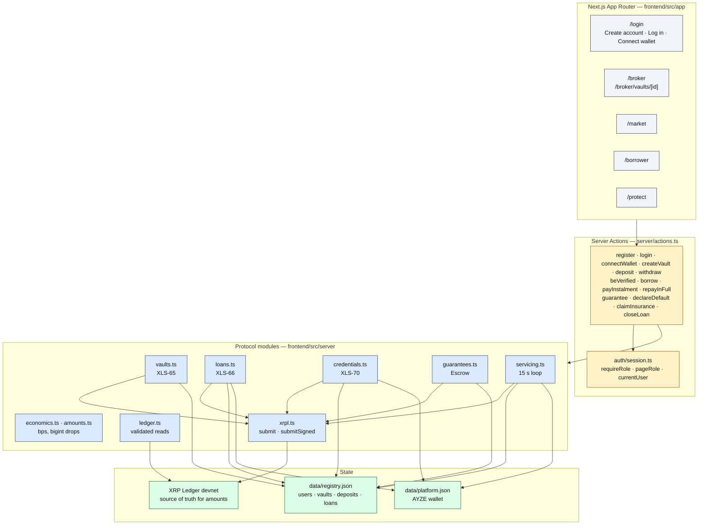
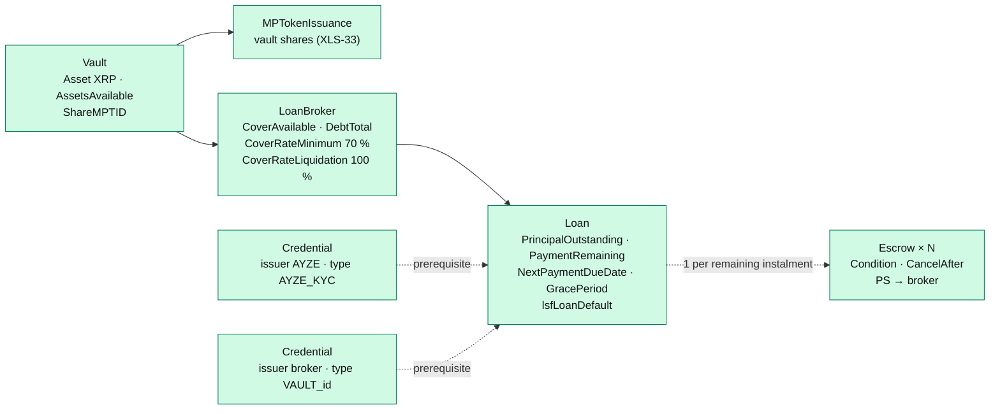
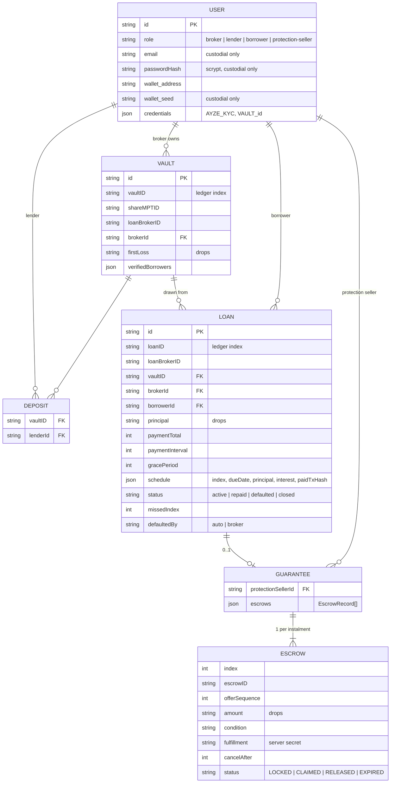
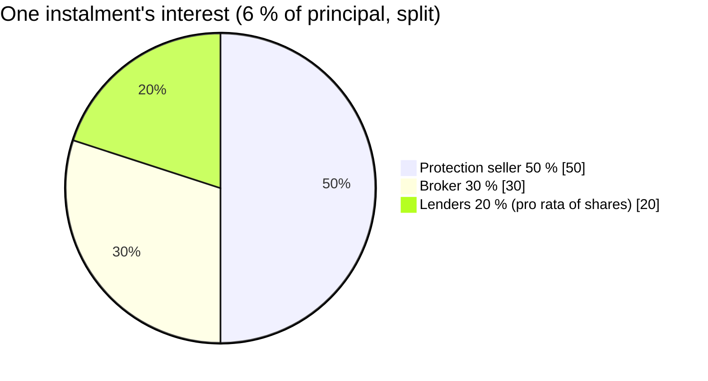

# AYZE — overview

AYZE is a **marketplace of lending vaults on the XRP Ledger**. A broker opens a vault and posts
first-loss capital; lenders fund it; borrowers draw fixed 1,000 XRP tickets; protection sellers
guarantee each loan with conditional escrows. Everything settles in **native XRP**.

## 1. The five actors

| Actor | Wallet | Where the seed lives | File |
|---|---|---|---|
| Broker | custodial | `registry.json` (`users[].wallet.seed`) | `accounts.ts › registerUser` |
| Borrower | custodial | `registry.json` | `accounts.ts › registerUser` |
| Lender | wallet-only | AES-256-GCM session cookie only | `accounts.ts › connectWalletAccount / generateWalletAccount` |
| Protection seller | wallet-only | AES-256-GCM session cookie only | same |
| AYZE | platform | `data/platform.json` | `platform.ts › ensurePlatform` |

## 2. Layers

Golden rule: **the ledger is the source of truth for every amount** (vault, cover, loan, escrows,
balances). The registry only holds the *matching* (who owns / deposited / guaranteed what) and the
server-side secrets (custodial seeds, escrow fulfillments).

## 3. Objects created on the ledger

## 4. Application registry (model)

File: `frontend/src/server/registry.ts` (`readRegistry`, `updateRegistry` — atomic write by
rename, writers serialised through a promise chain).

## 5. Economics (integer bps)

Source: `frontend/src/server/economics.ts`. Every amount is in **`bigint` drops** (`amounts.ts`),
never a float.

| Constant | Value | Purpose |
|---|---|---|
| `TICKET` | 1,000 XRP | fixed loan size |
| `INTEREST_BPS` | 600 (6 %) | flat interest over the loan life, paid off-chain by `Payment` |
| `INTEREST_SPLIT_BPS` | PS 5,000 · broker 3,000 · lender 2,000 | split of each instalment's interest |
| `AYZE_FEE_BPS` | 50 (0.5 %) | AYZE origination fee |
| `FIRST_LOSS_BPS` | 7,000 (70 %) | broker cover required per open loan |
| `PROTECTION_BPS` | 4,000 (40 %) | PS escrows, per remaining instalment |
| `COVER_RATE_MINIMUM` | 70,000 (1/10 bps) | `LoanBrokerSet` parameter |
| `COVER_RATE_LIQUIDATION` | 100,000 | `LoanBrokerSet` parameter → the cover absorbs exactly 70 % of the remaining debt |
| `DEFAULT_GRACE_BPS` | 1,000 (10 % of duration) | `GracePeriod`, clamped to [60 s, interval] |
| `CLAIM_WINDOW` | 300 s | window after `due + grace` for `EscrowFinish` |
| `TERMS` | 1–12 instalments, interval ≥ 60 s | XLS-66 bounds |

**Default at instalment k** (remaining principal R): the ledger moves `min(0.7 R, R, cover)` = 0.7 R
from the cover to the vault; the broker claims escrows k..N = 0.4 R. Net: broker −0.3 R,
PS −0.4 R, lenders −0.3 R.

## 6. Error codes

Source: `frontend/src/server/errors.ts`. Errors are **data**
(`ActionResult { ok:false, code, message, hashes }`), never exceptions thrown at the UI.

| Code | Raised by | When |
|---|---|---|
| `AYZE_UNAUTHENTICATED` | `session.ts › requireRole` | no session cookie |
| `AYZE_FORBIDDEN_ROLE` | `session.ts › requireRole` | action outside the role |
| `AYZE_KYC_REQUIRED` | `credentials.ts › assertVaultAccess` | borrow without both credentials accepted on-chain |
| `AYZE_INSUFFICIENT_LIQUIDITY` | `loans.ts › borrow` | `AssetsAvailable` < 1,000 XRP |
| `AYZE_BROKER_COVER_INSUFFICIENT` | `vaults.ts › createVault`, `loans.ts › borrow` | first-loss too small / `CoverAvailable` < 70 % of (`DebtTotal` + ticket) |
| `AYZE_INSUFFICIENT_FUNDS` | `vaults.ts`, `loans.ts`, `guarantees.ts` | spendable balance (balance − reserve) too low |
| `AYZE_ALREADY_GUARANTEED` | `guarantees.ts › guaranteeLoan` | loan already guaranteed |
| `AYZE_LOAN_NOT_DEFAULTED` | `guarantees.ts › claimInsurance` | claim on a non-defaulted loan |
| `AYZE_LOAN_CLOSED` | `loans.ts` | action on a loan that is no longer active |
| `AYZE_INVALID_TERMS` | `economics.ts › validateTerms` | instalments / interval out of bounds |
| `AYZE_INVALID_INPUT` | `actions.ts` | invalid form field |
| `AYZE_NOT_FOUND` | everywhere | object missing from registry / ledger |
| `AYZE_EMAIL_TAKEN`, `AYZE_BAD_CREDENTIALS` | `accounts.ts`, `actions.ts › login` | sign-up / sign-in |
| `XRPL_<tec…>` | `xrpl.ts › submit` | ledger rejection passed through (`XRPL_tecTOO_SOON`, `XRPL_tecEXPIRED`…) |
