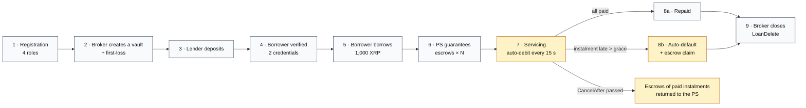
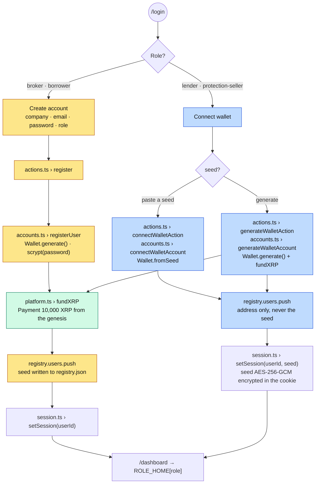
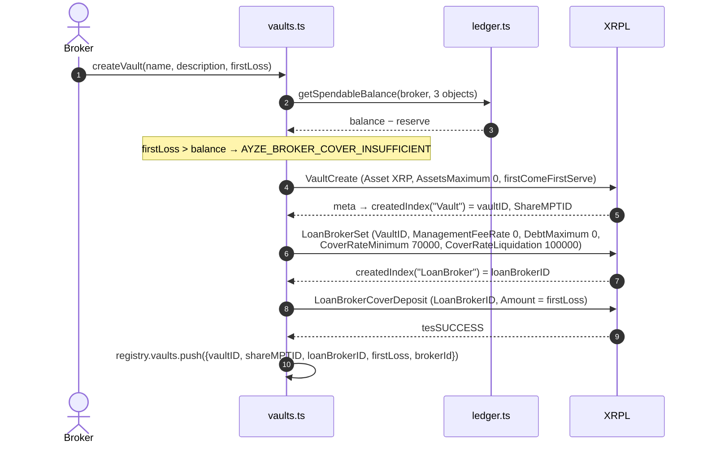
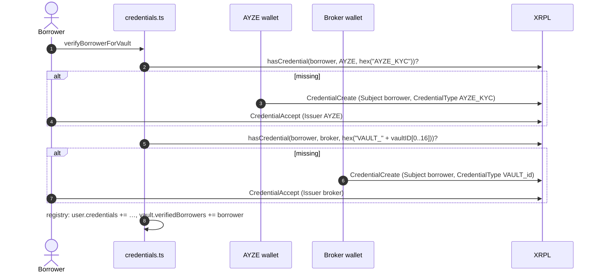
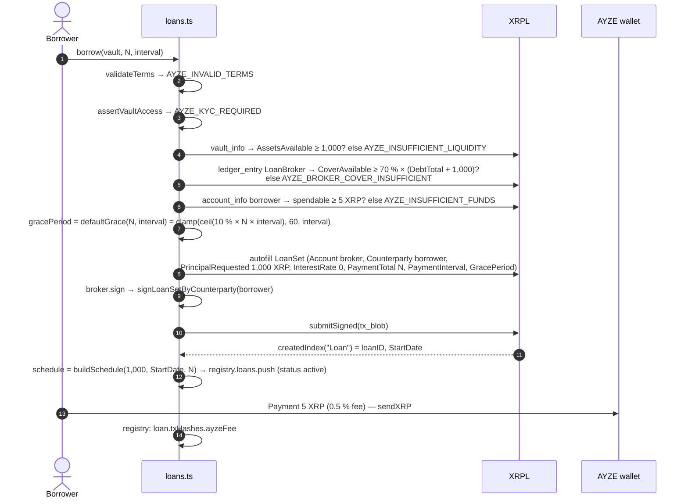
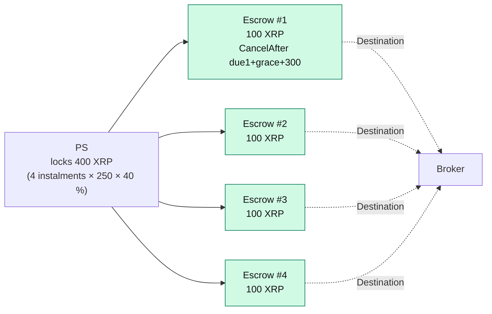
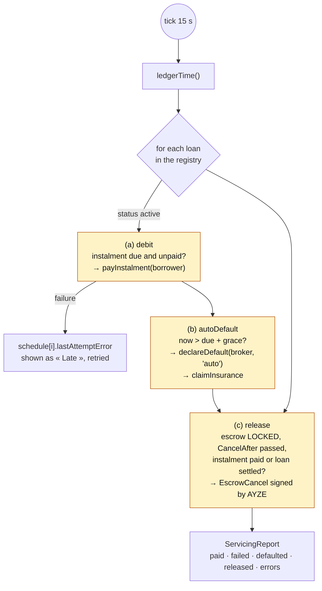
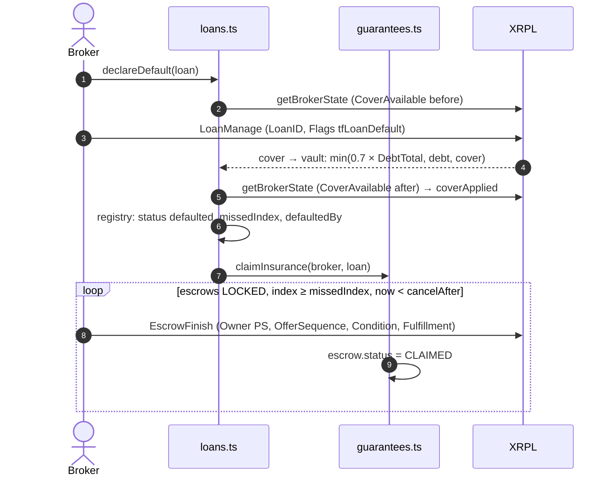
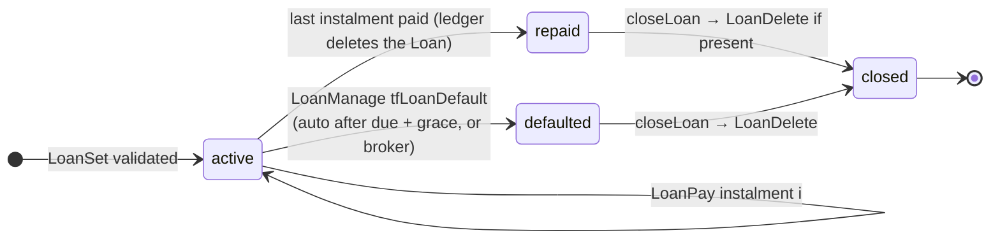
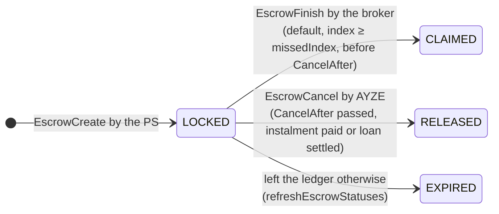

# General roadmap — from registration to loan close

This document follows one loan end to end: who does what, in which order, which transaction hits
the ledger and which function signs it. Files are in `frontend/src/server/`.

## 0. Big picture



## 1. Registration

Two paths depending on the role. Page: `/login` (`app/login/auth-form.tsx`, 3 tabs:
*Log in*, *Create account*, *Connect wallet*).



| Role | Function | Transactions | Where the seed goes |
|---|---|---|---|
| broker, borrower | `registerUser` | `Payment` genesis → wallet (10,000 XRP) | `registry.json` |
| lender, PS (new) | `generateWalletAccount` | `Payment` genesis → wallet | encrypted cookie, shown once |
| lender, PS (existing) | `connectWalletAccount` | none | encrypted cookie |

No credential is issued at registration: KYC is **per vault** (step 4).

## 2. Broker: create a vault

`actions.ts › createVaultAction` → `vaults.ts › createVault(broker, name, description, firstLoss)`



Stops at the first ledger rejection (`AyzeError XRPL_<code>`). One LoanBroker per vault: every loan
of the vault is drawn through it, and the cover must cover 70 % of the total open debt.

## 3. Lender: deposit

`actions.ts › depositAction` → `vaults.ts › deposit(lender, vault, amount)` → `VaultDeposit`.
The lender receives shares (MPT `ShareMPTID`, XLS-33). The registry records `{ vaultID, lenderId }`
to find a vault's lenders when interest is distributed; proportions come from the ledger
(`getShareBalance`).

`withdraw(lender, vault, amount | null)` → `VaultWithdraw` in drops, or in shares
(`mpt_issuance_id`) to redeem everything.

## 4. Borrower: get verified for a vault (KYC XLS-70)

*Be verified* button on `/market`. `actions.ts › beVerifiedAction` →
`credentials.ts › verifyBorrowerForVault(borrower, vault)`.



`tecDUPLICATE` on `CredentialCreate` is tolerated (credential issued but not yet accepted).
Before every borrow, `assertVaultAccess` re-reads both credentials on the ledger
(`ledger_entry` type `credential`, `lsfAccepted` flag); registry fallback if the RPC fails.

## 5. Borrower: borrow

`actions.ts › borrowAction` → `loans.ts › borrow(borrower, vault, { paymentTotal, paymentInterval })`



If the fee fails the loan already exists: the missing hash shows in the UI and the loan stays active.

## 6. Protection seller: guarantee the loan

`actions.ts › guaranteeAction` → `guarantees.ts › guaranteeLoan(seller, loan)`

For **each remaining instalment** i: one native-XRP `EscrowCreate` PS → broker of
`40 % × principal_i`, `Condition` = PREIMAGE-SHA-256 of a random preimage (fulfillment kept in the
registry), `CancelAfter = due_i + grace + CLAIM_WINDOW (300 s)`.



## 7. Servicing: the automatic loop

`servicing.ts › runServicing()` — started by `instrumentation.ts › startServicing()` every
`SERVICING_INTERVAL_MS` = 15 s, and on demand through `POST /api/servicing/run`. One pass per
process at a time (`inFlight`).



### 7a. Pay an instalment

`loans.ts › payInstalment(borrower, loan)` — called by the loop **and** by the manual
*Pay instalment* button (`payInstalmentAction`). *Repay in full* (`repayInFull`) chains every
remaining instalment.

```mermaid
sequenceDiagram
    autonumber
    actor Bo as Borrower
    participant Lo as loans.ts
    participant X as XRPL
    actor PS as Protection seller
    actor Br as Broker
    actor Le as Lenders

    Lo->>X: getLoanState(loanID) → periodicPayment, paymentRemaining, nextPaymentDueDate
    Lo->>Lo: principal_i = last? totalValueOutstanding : periodicPayment
    Lo->>Lo: splitInterest(interest_i) → 50 / 30 / 20; lenderWeights (MPT shares)
    Bo->>X: LoanPay (Amount principal_i, Flags tfLoanLatePayment if now ≥ due)
    Note over Lo,X: tecEXPIRED / tecTOO_SOON → one retry with the other variant
    Bo->>PS: Payment 50 % of interest (or → broker when there is no PS)
    Bo->>Br: Payment 30 % (+ lender share when no lender is on record)
    Bo->>Le: Payment 20 % pro rata of shares, one per lender
    Lo->>X: getLoanState → repaid? registry status = repaid
```

### 7b. Default and insurance

`loans.ts › declareDefault(broker, loan, by)` then `guarantees.ts › claimInsurance(broker, loan)`.
Fired automatically by the loop once `now > due + grace`, or manually by the broker
(*Declare default* → before `due + grace` the ledger answers `tecTOO_SOON`, shown as is).



## 8. Close

`actions.ts › closeLoanAction` → `loans.ts › closeLoan(broker, loan)`: possible once the loan is
`repaid` or `defaulted`. `LoanDelete` if the Loan entry still exists. The vault's LoanBroker and
its cover **stay** for the next loans; only a legacy per-loan LoanBroker (vaults from before v1.1)
is drained (`LoanBrokerCoverWithdraw`) then deleted (`LoanBrokerDelete`).

## 9. Lifecycle — states





## 10. Demo script

`node frontend/scripts/demo.mjs [--base http://localhost:3000] [--from <step>]` replays the whole
journey against a running dashboard (Playwright, real devnet transactions):
`register → vault → deposit → borrow → guarantee → pay → rbac → default → close → balances`.
