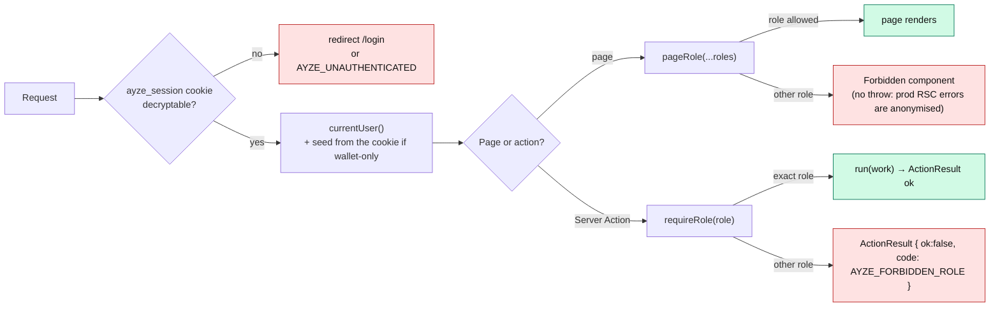
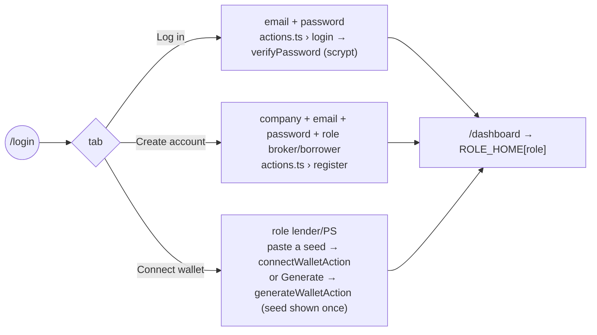

# Roles — accessing the platform

**Fixed RBAC**: one role per account, chosen at sign-up / connect, never changed. An action outside
the role is refused **before** any transaction (`AYZE_FORBIDDEN_ROLE`). Source:
`frontend/src/lib/roles.ts`, `frontend/src/server/auth/session.ts`.

## Matrix

| Role | Account type | Home (`ROLE_HOME`) | Navigation | Allowed pages (`pageRole`) | Server Actions (`requireRole`) |
|---|---|---|---|---|---|
| **Broker** | custodial | `/broker` | My vaults | `/broker`, `/broker/vaults/[id]` | `createVaultAction`, `declareDefaultAction`, `claimInsuranceAction`, `closeLoanAction` |
| **Lender** | wallet-only | `/market` | Marketplace | `/market` | `depositAction`, `withdrawAction` |
| **Borrower** | custodial | `/market` | Marketplace · My loans | `/market`, `/borrower` | `beVerifiedAction`, `borrowAction`, `payInstalmentAction`, `repayInFullAction` |
| **Protection seller** | wallet-only | `/protect` | Protection | `/protect` | `guaranteeAction` |
| AYZE (implicit) | platform | — | — | — | signs `CredentialCreate AYZE_KYC`, `EscrowCancel`; receives the fee |

Per role: [broker](broker.md) · [lender](lender.md) · [borrower](borrower.md) ·
[protection seller](protection-seller.md) · [AYZE platform](platform.md).

## Two guard levels

## Session

- Cookie `ayze_session`, `httpOnly`, `sameSite: lax`, **AES-256-GCM** encrypted (key = SHA-256 of
  `AYZE_SESSION_SECRET`). Payload: `{ userId, seed? }`.
- Custodial roles: `seed` absent from the cookie, read from `registry.json`.
- Wallet-only roles: `seed` lives **only** in the cookie; `currentUser()` merges it in memory so
  `walletOf(user)` behaves the same for every role. `logout` deletes the cookie → the seed is gone.

## Sign-in screen (`/login`)

