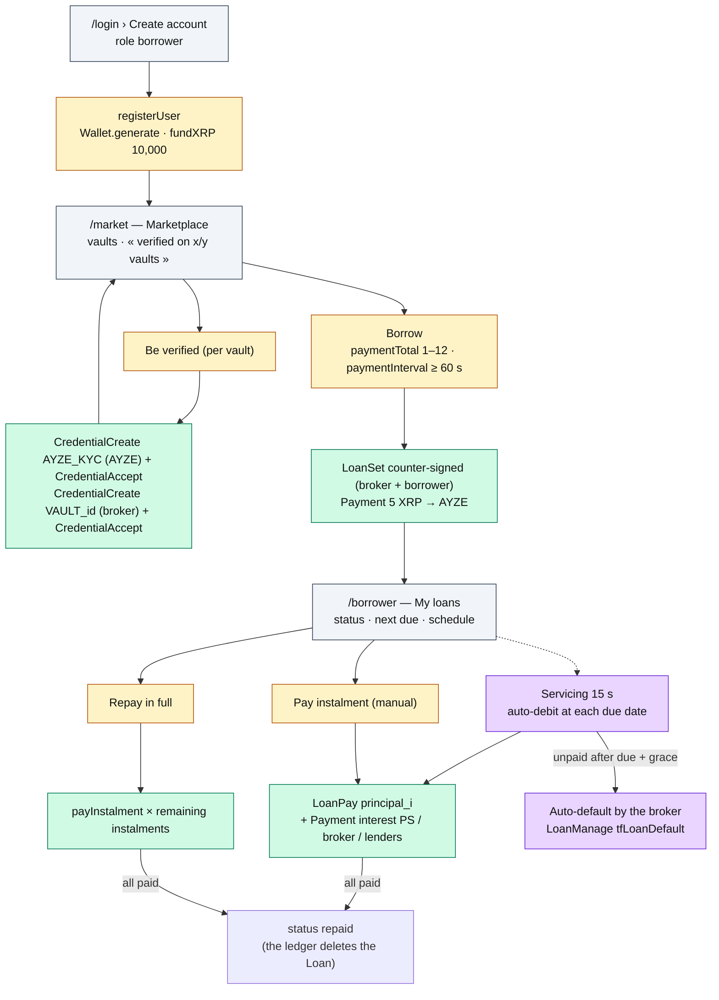

# Roadmap — Borrower

The borrower finances their business: gets verified **per vault** (two XLS-70 credentials), draws
a fixed 1,000 XRP ticket, then instalments are **auto-debited** by the servicing loop (they can
also pay manually or repay in full).

**Account**: custodial (company, email, password) — the seed is in `registry.json`, which is what
makes automatic debit possible. **Home**: `/market`.

## Journey

## What they see

| Page | Content | Source |
|---|---|---|
| `/market` | Wallet XRP + « verified on x/y vaults »; per vault: available, loans, **Be verified** button or **Borrow** form (when verified and ≥ 1,000 XRP available) | `views.ts › listVaults`, `credentials.ts › hasVaultAccess` |
| `/borrower` | Wallet; **My loans**: `LoanCard` (vault, broker, ledger status, next due, schedule with `paid / upcoming / due / late / defaulted`, last auto-debit error), Pay instalment / Repay in full buttons | `views.ts › loanView`, `ledger.ts › getLoanState` |

## What they can do

| UI action | Server Action | Protocol function | Transactions | Typical errors |
|---|---|---|---|---|
| Be verified | `beVerifiedAction` | `credentials.ts › verifyBorrowerForVault` | `CredentialCreate` ×2 + `CredentialAccept` ×2 | `AYZE_FORBIDDEN_ROLE`, `AYZE_NOT_FOUND` |
| Borrow | `borrowAction` | `loans.ts › borrow` | `LoanSet` (co-signed), `Payment` 0.5 % | `AYZE_INVALID_TERMS`, `AYZE_KYC_REQUIRED`, `AYZE_INSUFFICIENT_LIQUIDITY`, `AYZE_BROKER_COVER_INSUFFICIENT`, `AYZE_INSUFFICIENT_FUNDS` |
| Pay instalment | `payInstalmentAction` | `loans.ts › payInstalment` | `LoanPay` (+ `tfLoanLatePayment` when late), `Payment` × (PS, broker, lenders) | `AYZE_INSUFFICIENT_FUNDS`, `AYZE_LOAN_CLOSED` |
| Repay in full | `repayInFullAction` | `loans.ts › repayInFull` | same, for every remaining instalment | same |

## Loan terms

| Parameter | Value | Source |
|---|---|---|
| Principal | fixed 1,000 XRP (`TICKET`) | `economics.ts` |
| Instalments `paymentTotal` | 1 to 12 | `TERMS`, XLS-66 bound `PaymentTotal ≥ 1` |
| Interval `paymentInterval` | ≥ 60 s | XLS-66 bound |
| `GracePeriod` | `ceil(10 % × N × interval)` clamped to [60 s, interval] | `economics.ts › defaultGrace` |
| Interest | 6 % flat, split into N equal parts, paid by `Payment` | `buildSchedule`, `splitInterest` |
| AYZE fee | 5 XRP at origination | `ayzeFeeOf` |

The schedule (`schedule[]`) is computed once at origination from the ledger Loan's `StartDate`
and drives both the PS escrows and the payments.
