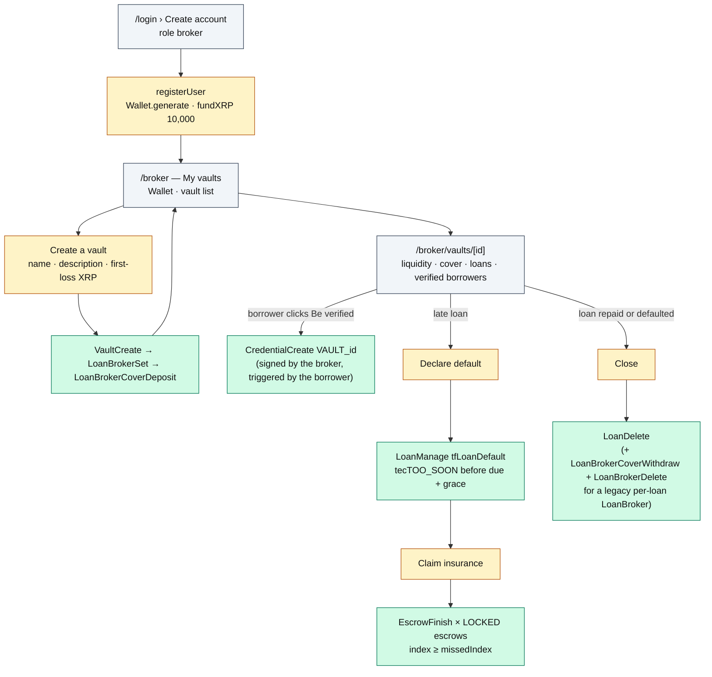

# Roadmap — Broker

The broker structures deals: opens vaults, posts first-loss capital, issues the access credential
for their vault, declares defaults and claims the insurance.

**Account**: custodial (company, email, scrypt password) — the wallet seed is in `registry.json`.
**Home**: `/broker`.

## Journey

## What they see

| Page | Content | Source |
|---|---|---|
| `/broker` | Wallet XRP; per vault: liquidity available/total, cover available/posted, active loans, defaulted; *Create a vault* form | `views.ts › listVaults(v => v.brokerId === me)` |
| `/broker/vaults/[id]` | Vault / LoanBroker addresses, XRP activity of the broker and of the vault pseudo-account, stats, *Verified borrowers*, loan list with actions | `views.ts › loanView`, `ledger.ts › getAccountActivity` |

## What they can do

| UI action | Server Action | Protocol function | Transactions | Typical errors |
|---|---|---|---|---|
| Create a vault | `createVaultAction` | `vaults.ts › createVault` | `VaultCreate`, `LoanBrokerSet`, `LoanBrokerCoverDeposit` | `AYZE_BROKER_COVER_INSUFFICIENT`, `AYZE_INVALID_INPUT` |
| Declare default | `declareDefaultAction` | `loans.ts › declareDefault` (+ `claimInsurance`) | `LoanManage tfLoanDefault`, then `EscrowFinish` × n | `XRPL_tecTOO_SOON` (guardrail), `AYZE_LOAN_CLOSED` |
| Claim insurance | `claimInsuranceAction` | `guarantees.ts › claimInsurance` | `EscrowFinish` × n | `AYZE_LOAN_NOT_DEFAULTED`, `AYZE_NOT_FOUND` (already claimed / expired) |
| Close | `closeLoanAction` | `loans.ts › closeLoan` | `LoanDelete` (+ `LoanBrokerCoverWithdraw`, `LoanBrokerDelete`) | `AYZE_LOAN_CLOSED` |

The broker also signs, without clicking: the `LoanSet` of every borrow (co-signature with the
borrower, `loans.ts › borrow`) and the `CredentialCreate VAULT_<id>`
(`credentials.ts › verifyBorrowerForVault`). The servicing loop declares defaults on their behalf
(`defaultedBy: "auto"`).

## What they earn / risk

- **Earn**: 30 % of each instalment's interest (50 % + 30 % when the loan has no PS), received as a
  direct `Payment` from the borrower. Escrows claimed after a default (40 % of the remaining
  principal).
- **Risk**: 70 % of the remaining debt on default, taken from `CoverAvailable` by the ledger
  (`CoverRateMinimum 70 % × CoverRateLiquidation 100 %`). Net after insurance: −30 %.
- **Constraint**: the cover must be ≥ 70 % of (`DebtTotal` + 1,000) for each new borrow to go
  through (`AYZE_BROKER_COVER_INSUFFICIENT`).
