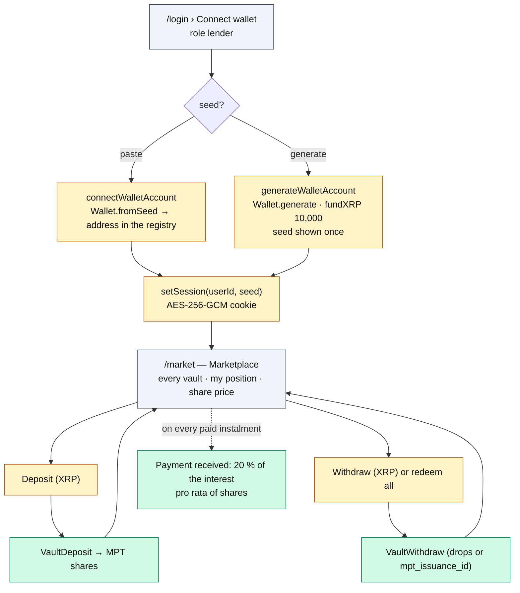

# Roadmap — Lender

The lender brings liquidity: deposits XRP into a vault and receives shares (MPT). No email
account: they **connect a wallet**.

**Account**: wallet-only — the seed is never written to disk, only encrypted in the session
cookie. **Home**: `/market`.

## Journey

## What they see

| Page | Content | Source |
|---|---|---|
| `/market` | Wallet XRP; per vault: broker, description, available/total, loans (active · repaid · defaulted · cover), **My position** (value + shares), **Share price**; Deposit / Withdraw forms | `views.ts › listVaults`, `lenderPosition` (`getShareBalance` × `pricePerShare`) |

## What they can do

| UI action | Server Action | Protocol function | Transaction | Typical errors |
|---|---|---|---|---|
| Deposit | `depositAction` | `vaults.ts › deposit` | `VaultDeposit` | `AYZE_INSUFFICIENT_FUNDS` (balance − reserve − 1 MPToken object) |
| Withdraw | `withdrawAction` | `vaults.ts › withdraw` | `VaultWithdraw` | `AYZE_INSUFFICIENT_FUNDS` (no shares) |

The registry only records `{ vaultID, lenderId }`: proportions come from the MPT balance on the
ledger (`ledger.ts › getShareBalance`, used by `loans.ts › lenderWeights`).

## What they earn / risk

- **Earn**: 20 % of each instalment's interest, split pro rata of the shares held at payment time
  (`amounts.ts › splitProRata`, rounding remainder to the largest holder), paid by direct
  `Payment` — not through vault yield.
- **Risk**: 30 % of the remaining debt on default — the ledger only brings 70 % back from the
  broker's cover into the vault; the share price drops accordingly.
- The vault pseudo-account (`Vault.Account`) cannot be paid with a `Payment`: that is why interest
  goes straight to the lenders.
