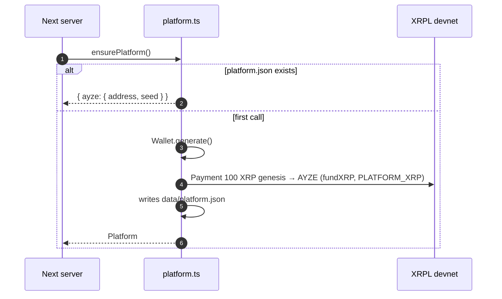

# AYZE — the implicit actor (platform wallet)

AYZE is not a role you can sign in as: it is a server wallet, created on first use and stored in
`data/platform.json` (`frontend/src/server/platform.ts`).

## Bootstrap

Only one bootstrap at a time (shared `bootstrapping` promise).

## What the AYZE wallet signs / receives

| Role | Transaction | Function | Trigger |
|---|---|---|---|
| KYC issuer | `CredentialCreate` type `hex("AYZE_KYC")` | `credentials.ts › verifyBorrowerForVault` | the borrower clicks *Be verified* (once per borrower) |
| Fee collector | receives `Payment` 5 XRP (0.5 % of the ticket) | `loans.ts › borrow` → `platform.ts › sendXRP` | every successful `LoanSet` |
| Releaser | `EscrowCancel` (Owner = PS, OfferSequence) | `servicing.ts › release` | instalment paid / loan settled and `CancelAfter` passed |
| Demo treasurer | `Payment` 10,000 XRP genesis → every new wallet | `platform.ts › fundXRP` (`DEMO_XRP`) | sign-up / wallet generation |

The genesis account (`XRPL_GENESIS_SEED`) is only used for devnet funding; it is not the AYZE
wallet.

## What AYZE does not do (V1)

- Never holds loan funds: principal and cover live in the Vault / LoanBroker; interest goes
  straight to its beneficiaries.
- Has no share in the interest split (50 / 30 / 20): its revenue is the origination fee only.
- The LoanBroker's `ManagementFeeRate` is 0: no on-chain fee is taken by the protocol (see
  `docs/amendments/xls66/`).
