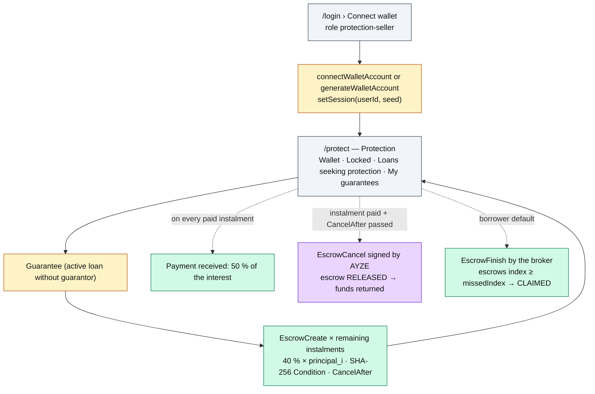

# Roadmap — Protection seller

The protection seller (PS) covers part of the risk: guarantees a loan by locking 40 % of each
remaining instalment in conditional escrows in favour of the broker. If the borrower defaults, the
broker claims the escrows of the unpaid instalments; otherwise they come back to the PS.

**Account**: wallet-only — the seed is never written to disk, only encrypted in the session
cookie. **Home**: `/protect`.

## Journey

## What they see

| Page | Content | Source |
|---|---|---|
| `/protect` | Wallet XRP; **Locked** (sum of LOCKED escrows, number of protected loans); **Loans seeking protection**: `active` loans without `guarantee` (vault, broker, borrower, amount to lock, Guarantee button); **My guarantees**: my loans with the escrow ladder and its status | `views.ts › loansWhere`, `loanView`; `guarantees.ts › refreshEscrowStatuses` |

## What they can do

| UI action | Server Action | Protocol function | Transactions | Typical errors |
|---|---|---|---|---|
| Guarantee | `guaranteeAction` | `guarantees.ts › guaranteeLoan` | `EscrowCreate` × remaining instalments | `AYZE_ALREADY_GUARANTEED`, `AYZE_LOAN_CLOSED`, `AYZE_INSUFFICIENT_FUNDS` (balance − reserve − 1 object per escrow) |

The PS signs nothing else. Two transactions concern them without their involvement:
`EscrowFinish` (broker, after default) and `EscrowCancel` (AYZE, release).

## Escrow ladder — 4-instalment example

```mermaid
gantt
    title Escrows of a 1,000 XRP loan, 4 instalments of 90 s, grace 60 s, claim window 300 s
    dateFormat X
    axisFormat %s s
    section Instalments
    #1 due          :milestone, m1, 90, 0
    #2 due          :milestone, m2, 180, 0
    #3 due          :milestone, m3, 270, 0
    #4 due          :milestone, m4, 360, 0
    section Escrows (100 XRP each)
    Escrow #1 LOCKED until CancelAfter 450 :e1, 0, 450
    Escrow #2 LOCKED until CancelAfter 540 :e2, 0, 540
    Escrow #3 LOCKED until CancelAfter 630 :e3, 0, 630
    Escrow #4 LOCKED until CancelAfter 720 :e4, 0, 720
```

`CancelAfter_i = due_i + grace + CLAIM_WINDOW`. Before that date the broker can `EscrowFinish`
with the fulfillment (kept server-side in the registry); after it, the servicing loop
`EscrowCancel`s as soon as instalment i is paid (or the loan settled).

## What they earn / risk

- **Earn**: 50 % of each instalment's interest (the premium), as a direct `Payment` from the borrower.
- **Risk**: 40 % of the principal **remaining** at default time (escrows k..N claimed).
- Escrows of already-paid instalments come back: the guarantee covers exactly what is still owed,
  not a flat amount.
